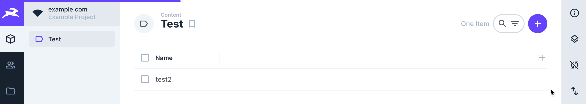

# Directus Woodpecker build status
An extension for [Directus](https://github.com/directus/directus) which adds a visual loader line to provide a visual feedback of current [Woodpecker](https://github.com/woodpecker-ci/woodpecker) build pipeline status.

## How it works
The woodpecker badge API is used to fetch the current pipeline status.
This results in 3 states which are represented in a small status bar:
* **success**: last build was successful (primary colored bar + fade out animation)
* **in-progress**: pipeline is currently running (primary colored bar + loading animation)
* **failed**: last build failed (red colored bar + blink animation)



## Installation
```shell
npm install directus-extension-woodpecker-build-status
```
## Configuration

### Build pipeline status URL
URL can be set per directus instance via environment variable with the following schema:    
``https://woodpecker.example.com/api/badges/<organization>/<repository>/cc.xml?branch=<branch>``  

Example:
```shell
WOODPECKER_BUILD_STATUS_URL="https://woodpecker.myserver.com/api/badges/myorg/myrepo/cc.xml?branch=main"
```

### Bar colors
Colors used in the bar are configured via default directus CSS variables.
For more information about directus CSS variables see official [directus docs](https://docs.directus.io/extensions/themes.html#project-styling).

| Status      | CSS variable |
|-------------|--------------|
| success     | --primary    |
| in-progress | --primary    |
| failed      | --danger     |
